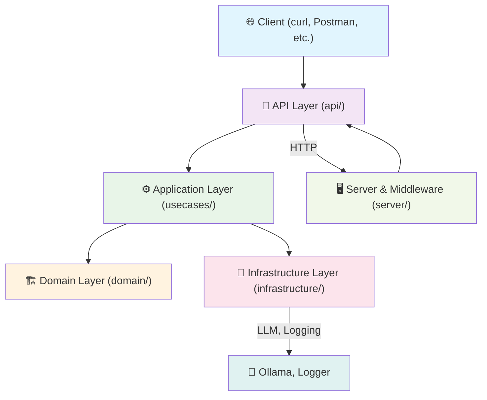

# MiniVault API

A minimal, production-grade REST API for prompt generation using a local LLM (Ollama with gemma:2b). Built with Domain-Driven Design (DDD) principles, clean architecture, and robust testing.

- Minimal, synchronous API for clarity.
- All logic is local; no cloud LLMs are used.

---

## ⚡ Quickstart

1. **Install Go 1.24+ and [Ollama](https://ollama.com/)**
2. **Pull the model:** `ollama pull gemma:2b`
3. **Run Ollama:** `ollama serve &`
4. **Start API:**
   ```bash
   go run cmd/main.go
   ```
   > ℹ️ Loads environment variables from a `.env` file if present (via [joho/godotenv](https://github.com/joho/godotenv)).
5. **Test:**
   ```bash
   curl -X POST http://localhost:8080/generate \
     -H 'Content-Type: application/json' \
     -d '{"prompt": "What is ModelVault?"}'
   ```

---

## ✨ Features

- 🦾 **Local LLM API**: Uses Ollama (default: `gemma:2b`) for fast, private prompt generation
- 🏛️ **Clean Architecture**: DDD-inspired, testable, and maintainable
- 🧪 **Comprehensive Unit Tests**: Mocks for all ports/interfaces
- 📝 **Structured Logging**: JSONL logs for generations, console logs for errors/info
- ⚙️ **Configurable via `.env`**: Easily override defaults
- 🔒 **Request Validation**: Strict input checks and error handling
- 🪝 **Middleware**: Request body size limit (4KB), panic recovery, and more

---

## 🏛️ Architecture

**Layered, DDD-inspired structure:**



**Layer Descriptions:**
- **🌐 Client**: Sends HTTP requests to the API.
- **🔌 API Layer (`api/`)**: Parses requests, validates input, delegates to usecases, formats responses.
- **🖥️ Server & Middleware (`server/`)**: Sets up HTTP server, routes, body size limit (4KB), panic recovery, etc.
- **⚙️ Application Layer (`usecases/`)**: Orchestrates business logic, implements domain interfaces, calls infrastructure.
- **🏗️ Domain Layer (`domain/`)**: Core business entities, validation, and interfaces (ports).
- **🔧 Infrastructure Layer (`infrastructure/`)**: Adapters for logging and LLM (Ollama), handles external communication.
- **⚙️ Config (`config/`)**: Centralized configuration management, loads env vars.
- **🧪 Mocks (`mocks/`)**: Test doubles for all ports/interfaces.

**Request Flow:**
> 🌐 Client → 🔌 API Handler → ⚙️ Usecase (Application) → 🏗️ Domain Validation → 🔧 Infrastructure (Ollama, Logger) → Response

---

## 📂 Code Structure

```
minivault/
├── api/                # HTTP handlers
├── cmd/                # Entry point (main.go)
├── config/             # Centralized configuration management
├── domain/             # Entities, validation, ports (interfaces)
├── infrastructure/     # Adapters: logging, LLM (Ollama)
├── mocks/              # Generated/test mocks
├── server/             # Server and middleware
├── usecases/           # Application/business logic
├── logs/               # Interaction logs (created at runtime)
├── go.mod, go.sum      # Go dependencies
└── README.md           # This file
```

---

## 🚀 API Documentation

### POST `/generate`
Generate a response for a given prompt using the local LLM.

- **URL:** `/generate`
- **Method:** `POST`
- **Content-Type:** `application/json`
- **Body Size Limit:** 4KB (4096 bytes)

#### Request Body
```json
{
  "prompt": "What is ModelVault?"
}
```

#### Response
```json
{
  "response": "..."
}
```

#### Error Responses
| Code | Description                | Example message         |
|------|----------------------------|------------------------|
| 400  | Invalid JSON / Validation  | "Invalid JSON" / "Validation error" |
| 405  | Method not allowed         | "Method not allowed"   |
| 500  | Internal error             | "Failed to generate response" |

- All responses include an `X-Request-ID` header for tracing.

#### Example Usage
```bash
curl -X POST http://localhost:8080/generate \
  -H 'Content-Type: application/json' \
  -d '{"prompt": "What is ModelVault?"}'
```

---

## ⚙️ Configuration

MiniVault uses environment variables (optionally loaded from a `.env` file) for configuration. The following settings are available:

| Variable         | Default                                 | Description                                                      |
|------------------|-----------------------------------------|------------------------------------------------------------------|
| MINIVAULT_PORT   | `:8080`                                 | The port/address the API server listens on                       |
| OLLAMA_URL       | `http://localhost:11434/api/chat`       | The URL for the Ollama chat API                                  |
| OLLAMA_MODEL     | `gemma:2b`                              | The Ollama model to use for generation (must be installed)       |

> **Tip:** Create a `.env` file in the project root to override these defaults. Example:
> ```env
> MINIVAULT_PORT=:8080
> OLLAMA_URL=http://localhost:11434/api/chat
> OLLAMA_MODEL=gemma:2b
> ```

> **Note:** The value of `OLLAMA_MODEL` must match a model that is installed in your local Ollama instance. For example, if you set `OLLAMA_MODEL=llama2:7b`, you must have run `ollama pull llama2:7b` beforehand.

---

## 🧪 Testing

- All business logic, HTTP handlers, and infrastructure are covered by unit tests.
- Mocks for all ports/interfaces (`mocks/` directory)
- Run all tests:
  ```bash
  go test ./...
  ```
- Key tests:
  - Success and error cases for `/generate`
  - Input validation, HTTP codes, and edge cases
  - Logging and infrastructure behavior

---

## 📜 Logging

- **Generation interactions**: Structured JSONL format, saved to `logs/log.jsonl`
- **Errors, warnings, info**: Console (with timestamps)
- Uses [zerolog](https://github.com/rs/zerolog) for structured logging

---

## 🛠️ Troubleshooting

- **Ollama not running?** Ensure you have started Ollama with `ollama serve &` and pulled the required model.
- **Port already in use?** Change `MINIVAULT_PORT` in your `.env` file.
- **No logs?** The `logs/` directory is created automatically. Check permissions if missing.
- **Prompt too large?** Requests over 4KB will be rejected.
- **Model not found?** Make sure the model in `OLLAMA_MODEL` is installed in your Ollama instance.

---

## 🛠️ Improvements & TODOs
- [ ] Streaming responses (token-by-token)
- [*] Make model/endpoint configurable via env vars
- [ ] Add CLI or Postman collection for easier testing
- [ ] Add more endpoints (health, status, etc.)
- [*] Expand test coverage (integration, infra)
- [ ] Enhance error handling and observability

---

_Made for the ModelVault take-home project._
